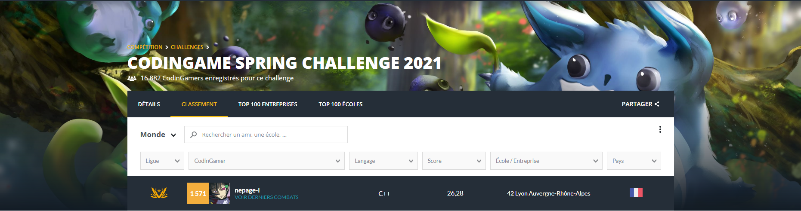

# Codingame

I decided I don't want to make my code public here anymore (I know old source code I posted here is still visible in git commit history but whatever).

## For the Spring Challenge 2021 (Photosynthesis), I finished 1571th out of 6867 participants.
### This time we had a lot more people from 42 Lyon taking part, and as a result we pushed 42 lyon into the top 52th place of universities worldwide!

Next autumn there will be another one and I will of course be there again!
